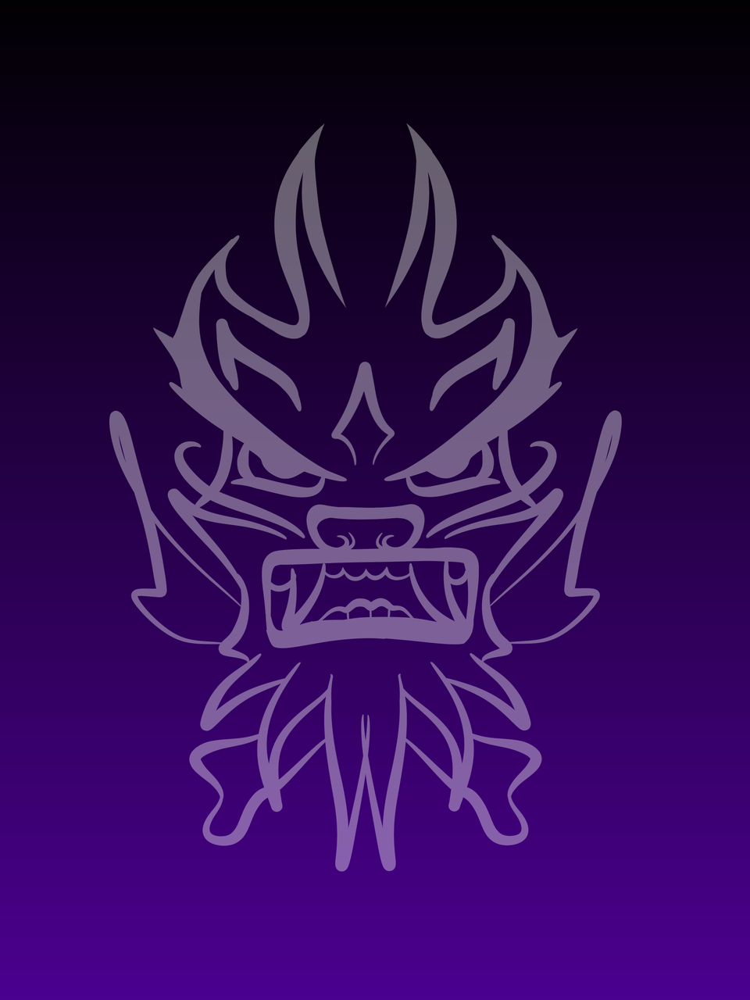
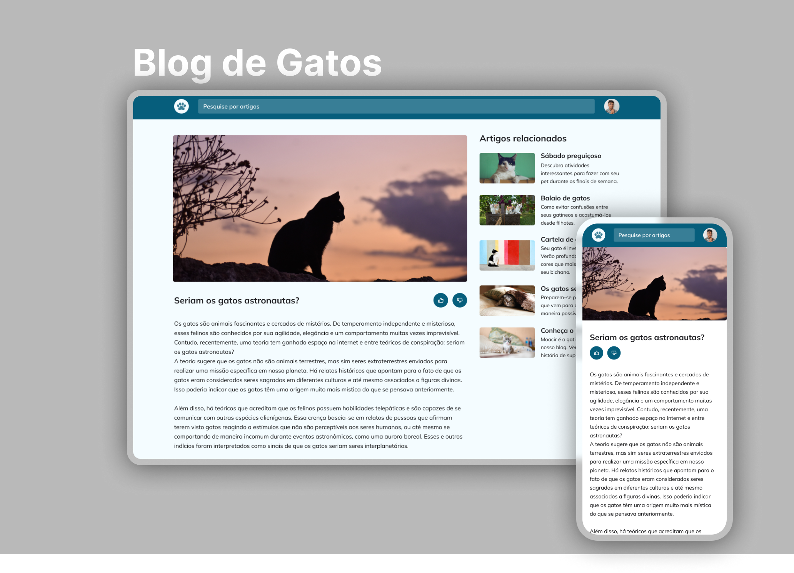

  

<h1 align="center">Página de Blog de Gatos. Projeto do Explorer - Rocketseat</h1>

 

  
  <a href="https://jlisarte.github.io/projeto_blog_gatos/" target="_blank">https://jlisarte.github.io/projeto_blog_gatos/</a>

## 🚀 Tecnologias

Esse projeto foi desenvolvido com as seguintes tecnologias:

- HTML, CSS e JS
- Git e Github
- Figma

## 💻 Projeto

Esse projeto é um site responsivo de blog com artigos sobre gatos. O projeto também apresenta uma barra de busca, recomendação de artigos relacionados e avaliação do artigo. 
É desenvolvido no nível 03 do Explorer.

---

Feito por Shadowkhan - Juliano Lisarte
